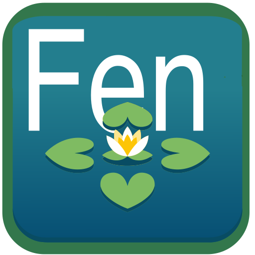
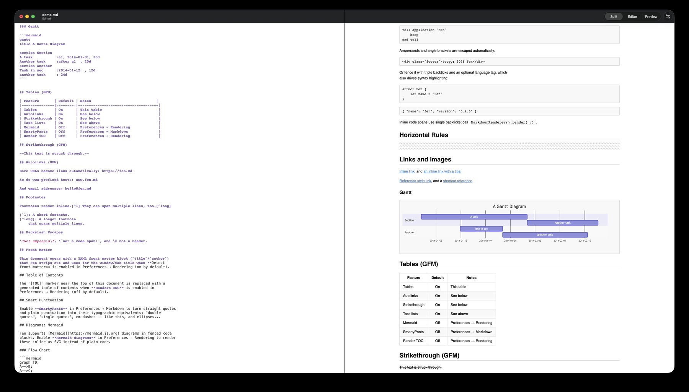

<p align="center">
  
</p>

<h1 align="center">Fen</h1>

<p align="center">A native <strong>Swift / SwiftUI</strong> Markdown editor for macOS and iOS — fast, minimal, and built for Apple Silicon.</p>

<p align="center">
  <a href="https://github.com/zoharbabin/fen/actions/workflows/ci.yml"></a>
  <a href="https://github.com/zoharbabin/fen/releases/latest"></a>
  <a href="LICENSE.md"></a>
  
</p>

<p align="center">
  <a href="https://github.com/zoharbabin/fen/releases/latest">Download</a> ·
  <a href="https://zoharbabin.com/fen/">Website</a> ·
  <a href="docs/ROADMAP.md">Roadmap</a> ·
  <a href="CONTRIBUTING.md">Contributing</a>
</p>

<p align="center">
  
</p>

Fen edits Markdown on one side and renders it live on the other, with the two panes scrolling in sync as you type. It supports GitHub-Flavored Markdown, MathJax, and Mermaid diagrams. And it's built to grow: your notes become a connected, searchable knowledge base instead of a pile of loose files. See [ROADMAP.md](docs/ROADMAP.md) for where that's headed.

## Features

- **Live preview with scroll sync** — the preview pane tracks your cursor as you type
- **GitHub-Flavored Markdown** via Apple's [`swift-cmark`](https://github.com/apple/swift-cmark) — tables, task lists, strikethrough, autolinks, footnotes
- **Syntax highlighting** in code blocks, **MathJax** for equations, and **Mermaid** for diagrams
- **Pure Swift + SwiftUI**, with a cross-platform core (macOS and iOS share `FenCore`) — no Objective-C, no CocoaPods
- **Apple Silicon native**, built with Swift Package Manager
- **Free and open source**, no telemetry, no account required
- **Signed and notarized** — every release opens without Gatekeeper warnings

## Install

Download the latest `Fen.app.zip` from the [Releases page](https://github.com/zoharbabin/fen/releases), unzip, and drag **Fen.app** to your Applications folder.

We sign every release with an Apple Developer ID and notarize it, so it opens without Gatekeeper warnings. Requires macOS 15+.

## Build from source

Requirements: macOS 15+ and a recent Xcode / Swift 6 toolchain.

```sh
git clone https://github.com/zoharbabin/fen.git
cd fen

swift build          # build the package
swift test           # run the test suite
swift run Fen        # launch the macOS app

./scripts/build-app.sh   # produce dist/Fen.app
```

See [RELEASING.md](docs/RELEASING.md) for signing, notarization, and cutting a release.

## Project layout

```
Shared/        FenCore — cross-platform model, rendering, editor, preview
macOS/         macOS app target (DocumentGroup, menus, Settings)
iOS/           iOS app target
Tests/         Swift Testing test suite
UITests/       UI tests (xcodegen-generated project, see CONTRIBUTING.md)
scripts/       build-app.sh — assembles the .app bundle
site/          zoharbabin.com/fen landing page (GitHub Pages)
docs/          architecture, roadmap, and release documentation
```

See [ARCHITECTURE.md](docs/ARCHITECTURE.md) for why things are shaped this way.

## Contributing

Fen is open to contributions — see [CONTRIBUTING.md](CONTRIBUTING.md) for coding style and pull request guidelines.

## License

Fen ships under the **MIT License** ([LICENSE.md](LICENSE.md)). Full license texts for every third-party component live in the [`LICENSE/`](LICENSE/) directory.

## Origin and thanks

Fen grew out of a full rewrite of [MacDown](https://github.com/MacDownApp/macdown), the open-source Markdown editor for macOS. **[Tzu-ping Chung](https://github.com/uranusjr)** and contributors created MacDown, drawing inspiration from [Chen Luo](https://twitter.com/chenluois)'s [Mou](http://mouapp.com). Fen is an independent rewrite, not a fork. The original hasn't shipped an update in years, and Apple is winding down support for Intel-only apps. We keep every original copyright and the MIT License intact. These editor themes and CSS files come from Mou, courtesy of Chen Luo:

* Mou Fresh Air / Fresh Air+
* Mou Night / Night+
* Mou Paper / Paper+
* Tomorrow / Tomorrow Blue / Tomorrow+
* Writer / Writer+
* Clearness / Clearness Dark
* GitHub / GitHub2

Fen also builds on [Highlightr](https://github.com/raspu/Highlightr), [highlight.js](https://highlightjs.org), [MathJax](https://www.mathjax.org), and [Mermaid](https://mermaid.js.org).
