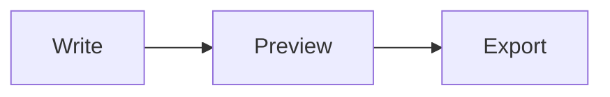

# Welcome to Fen

Fen edits Markdown on one side and renders it live on the other. This is a real document — try editing it.

## Formatting

You can write **bold**, _italic_, and `inline code`, or drop in a fenced code block:

```swift
func greet(name: String) -> String {
    "Hello, \(name)!"
}
```

## Tables

| Feature | Shortcut |
| --- | --- |
| Bold | Cmd+B |
| Focus mode | Cmd+Shift+F |
| Live preview | Cmd+Shift+P |

## Math

Fen renders inline math like $E = mc^2$ and block math:

$$
\int_0^1 x^2 \, dx = \frac{1}{3}
$$

## Diagrams



## Next steps

- Type `/` at the start of a line to insert a heading, table, or diagram from a menu.
- Open **Settings** (Cmd+,) to pick a theme and tune the editor.
- Start a new document with **File > New** whenever you're ready — it opens blank.
