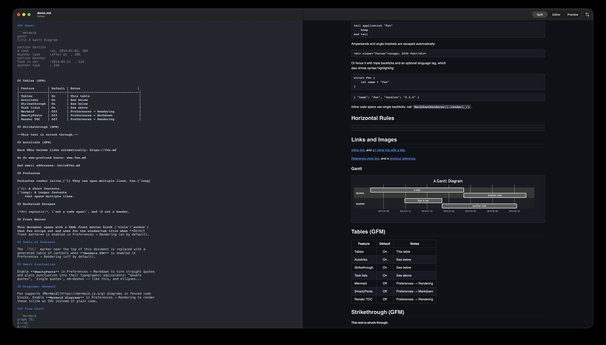
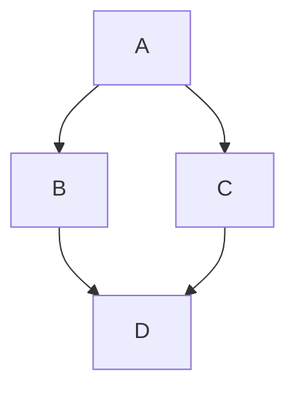
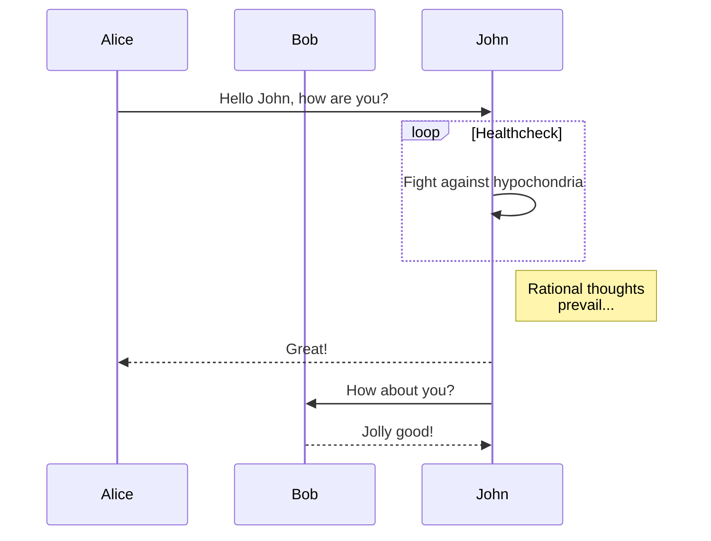
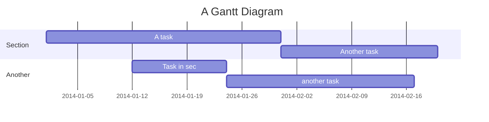

# Fen Markdown Reference & Test Suite

This document exercises the Markdown surface Fen supports: the original
[Markdown syntax](https://daringfireball.net/projects/markdown/syntax)
plus the [GitHub Flavored Markdown](https://github.github.com/gfm/)
extensions Fen ships with. Open it in Fen to sanity-check rendering after
any change to the parser, styles, or preview pipeline. Some sections note
a Preferences toggle — those features render only once that toggle is on;
everything else is on by default.

[TOC]

## Headers

Markdown supports two header styles. Setext:

Setext H1
=========

Setext H2
---------

And atx, optionally "closed" with trailing hashes that don't need to match
the opening count:

# ATX H1
## ATX H2
### ATX H3 ###
#### ATX H4
##### ATX H5
###### ATX H6

## Paragraphs and Line Breaks

A paragraph is one or more lines of text separated by a blank line.
Plain line breaks inside a paragraph, like this one,
are collapsed into a single space when rendered.

This line ends with two trailing spaces,  
which forces a hard `<br>` above it.

## Emphasis

*Single asterisks* and _single underscores_ render as `<em>`.

**Double asterisks** and __double underscores__ render as `<strong>`.

***Triple asterisks*** combine both.

Asterisks trigger emphasis mid-word: un*believe*able. Underscores
intentionally do not, so identifiers like `not_so_emphasized` are left
alone: un_believe_able.

## Blockquotes

Markdown uses email-style `>` quoting:

> This is a blockquote with two paragraphs. Lorem ipsum dolor sit amet,
> consectetuer adipiscing elit. Aliquam hendrerit mi posuere lectus.
>
> Donec sit amet nisl. Aliquam semper ipsum sit amet velit.

Lazy continuation only needs the `>` on the first line of each wrapped
paragraph:

> This is a blockquote with two paragraphs. Lorem ipsum dolor sit amet,
consectetuer adipiscing elit. Aliquam hendrerit mi posuere lectus.

Blockquotes nest:

> This is the first level of quoting.
>
> > This is a nested blockquote.
>
> Back to the first level.

And they can contain other block elements, including headers, lists, and
code blocks:

> ## A header inside a blockquote
>
> 1. First item
> 2. Second item
>
> Example code:
>
>     echo "inside a blockquote"

## Lists

Unordered lists use asterisks, pluses, and hyphens interchangeably:

* Red
* Green
* Blue

Ordered lists ignore the actual numbers you type — every item below
renders as `1.`, `2.`, `3.`:

1. Bird
1. McHale
1. Parish

List items can hold multiple paragraphs, a nested blockquote, and a
nested code block (indented twice — 8 spaces or two tabs):

1. First paragraph of this item.

   Second paragraph of the same item, indented to stay inside it.

2. A list item with a nested blockquote:

   > Quoted text inside a list item.

3. A list item with a nested code block:

       nested code block

Task lists (GFM):

- [x] Ship the Mermaid v11 upgrade
- [x] Fix inline diagram rendering
- [ ] Ship this demo rewrite

## Code Blocks

Indent every line by 4 spaces or a tab for a classic code block:

    tell application "Fen"
        beep
    end tell

Ampersands and angle brackets are escaped automatically:

    <div class="footer">&copy; 2026 Fen</div>

Or fence it with triple backticks and an optional language tag, which
also drives syntax highlighting:

```swift
struct Fen {
    let name = "Fen"
}
```

```json
{ "name": "fen", "version": "0.2.6" }
```

Inline code spans use single backticks: call `MarkdownRenderer().render(_:)`.

## Horizontal Rules

---

***

___

## Links and Images

[Inline link](https://fen.md), and [an inline link with a title](https://fen.md "Fen").

[Reference-style link][fen-site], and a [shortcut reference][].

[fen-site]: https://fen.md "Fen's homepage"
[shortcut reference]: https://fen.md



## Tables (GFM)

| Feature       | Default | Notes                              |
|---------------|:-------:|-------------------------------------|
| Tables        | On      | This table                          |
| Autolinks     | On      | See below                           |
| Strikethrough | On      | See below                           |
| Task lists    | On      | See above                           |
| Mermaid       | Off     | Preferences → Rendering             |
| SmartyPants   | Off     | Preferences → Markdown              |
| Render TOC    | Off     | Preferences → Rendering             |

## Strikethrough (GFM)

~~This text is struck through.~~

## Autolinks (GFM)

Bare URLs become links automatically: https://fen.md

So do www-prefixed hosts: www.fen.md

And email addresses: hello@fen.md

## Footnotes

Footnotes render inline.[^1] They can span multiple lines, too.[^long]

[^1]: A short footnote.
[^long]: A longer footnote
    that spans multiple lines.

## Backslash Escapes

\*Not emphasis\*, \`not a code span\`, and \# not a header.

## Front Matter

This document opens with a YAML front matter block (`title`/`author`)
that Fen strips out and uses for the window/tab title when **Detect
front matter** is enabled in Preferences → Rendering (on by default).

## Table of Contents

The `[TOC]` marker near the top of this document is replaced with a
generated table of contents when **Renders TOC** is enabled in
Preferences → Rendering (off by default).

## Smart Punctuation

Enable **SmartyPants** in Preferences → Markdown to turn straight quotes
and plain punctuation into their typographic equivalents: "double
quotes", 'single quotes', em-dashes -- like this, and ellipses...

## Diagrams: Mermaid

Fen supports [Mermaid](https://mermaid.js.org) diagrams in fenced code
blocks. Enable **Mermaid diagrams** in Preferences → Rendering to render
these inline as SVG instead of plain code.

### Flow Chart



### Sequence Diagram



### Gantt


