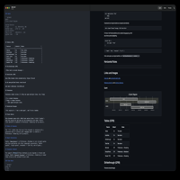
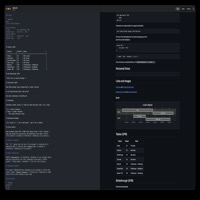
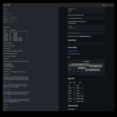
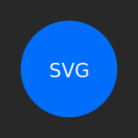
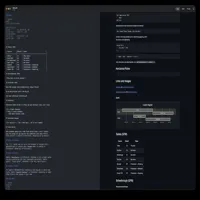

# Image Format Test

This file exercises Fen's preview across the image formats GitHub's Markdown renderer commonly supports — PNG, JPEG, GIF, SVG, and WebP — both as local relative-path files and as remote HTTP(S) URLs. Use it to confirm the preview loads every combination correctly.

## Local images (relative path)

Local PNG:

Local JPEG:

Local GIF:

Local SVG:

Local WebP:

## Remote images (HTTPS)

Remote PNG:

Remote JPEG:

Remote GIF:

Remote SVG:

Remote WebP:

## Reference-style links

Reference-style syntax exercises the same code path through a different parse route.

![Reference local PNG][local-png]
![Reference remote PNG][remote-png]

[local-png]: image-formats/local-sample.png "Reference local PNG"
[remote-png]: https://octodex.github.com/images/original.png "Reference remote PNG"

## Linked image

A local image wrapped in a link, so clicking it opens the full remote asset.

