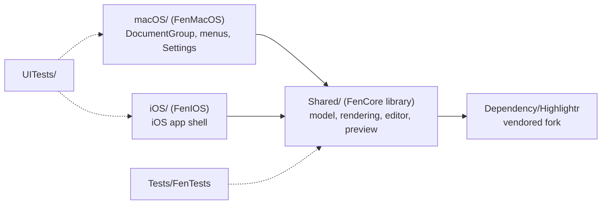
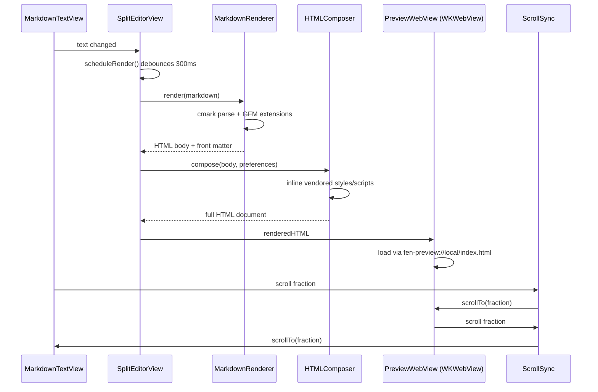
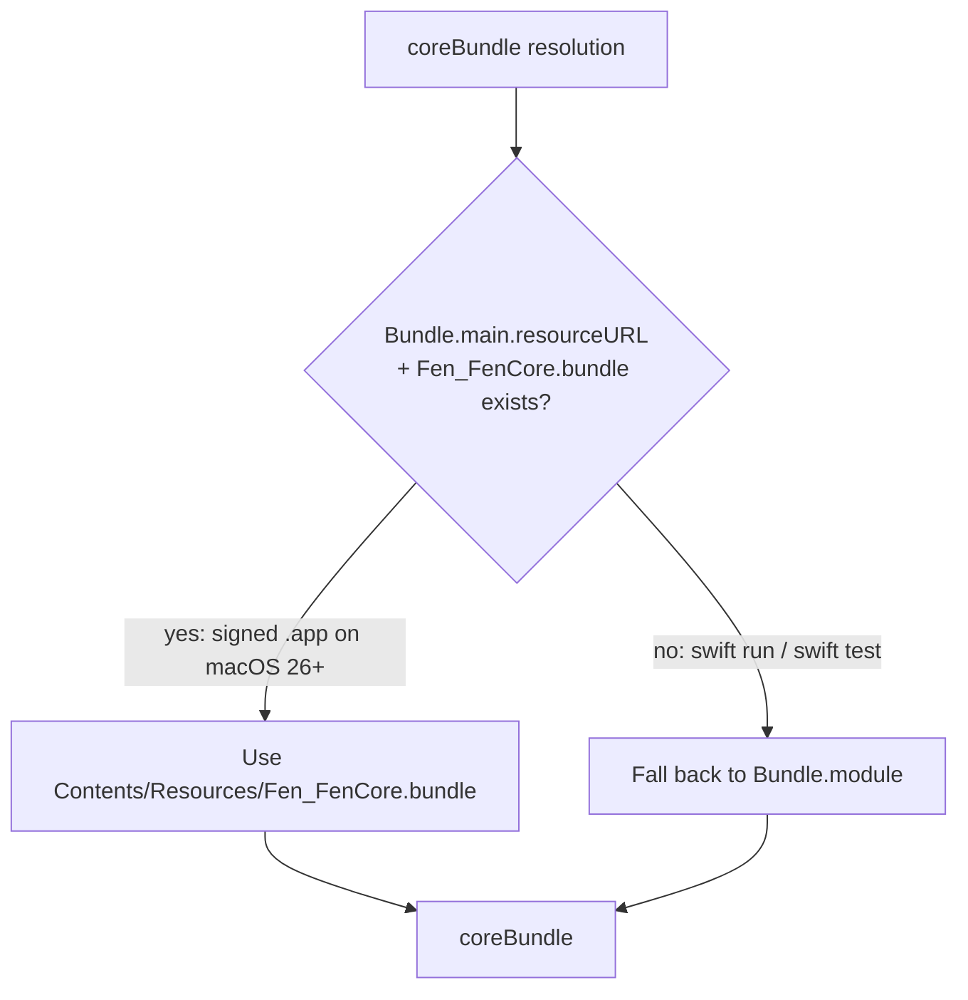
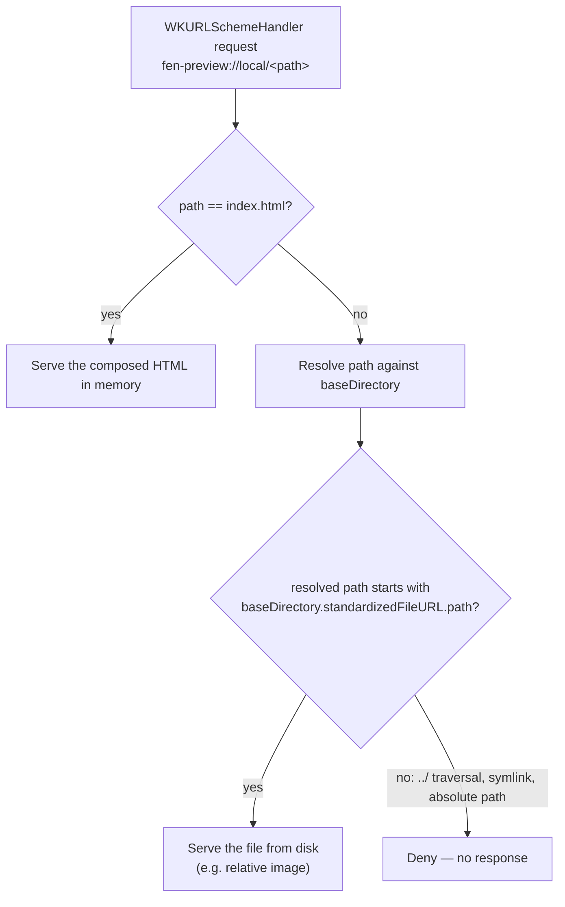
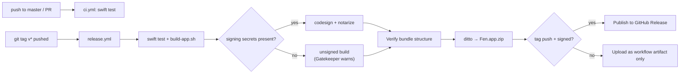

# Architecture

This covers the decisions that aren't obvious from reading the code — why things are shaped the way they are, and the bugs that shaped them. For what's built and what's next, see [ROADMAP.md](ROADMAP.md). For project layout, see [README.md](../README.md#project-layout).

## FenCore: one model, two platforms

`Shared/` builds as the `FenCore` library target. `macOS/` and `iOS/` are thin executable targets that depend on it — `FenMacOS` wires up `DocumentGroup`, menus, and `Settings`; `FenIOS` wires up the iOS shell. Neither platform target should carry business logic: if code doesn't need `AppKit` or `UIKit`, it belongs in `FenCore` so both platforms get it for free. See [CONTRIBUTING.md](../CONTRIBUTING.md#coding-style) for the enforcement rule.

## Editing to preview: the rendering pipeline

Typing in the editor doesn't re-render on every keystroke. `SplitEditorView.scheduleRender()` cancels any in-flight render `Task`, waits 300ms (skipped if `preferences.markdownManualRender` is set), then runs the document through `MarkdownRenderer` and `HTMLComposer` before handing the result to the `WKWebView`-backed preview. `ScrollSync` mirrors scroll position between the two panes as a fraction (0.0–1.0), guarded by an `isUpdating` flag so each pane's update doesn't re-trigger the other.

## Resource bundle resolution (`Shared/CoreBundle.swift`)

SwiftPM's generated `Bundle.module` accessor resolves resources against `Bundle.main.bundleURL`. That's correct for `swift run` and `swift test`, but wrong for a signed, distributed `.app`: macOS 26 requires nested resource bundles to live under `Contents/Resources/` (`Bundle.main.resourceURL`), not the bundle root. A build that only used `Bundle.module` crashed on file open on macOS 26 — fixed in v0.2.0–v0.2.4 (see `CoreBundle.swift`'s doc comment for the full resolution order).

`coreBundle` checks `resourceURL` first, falling back to `Bundle.module` for local dev builds. `scripts/build-app.sh` and the `release.yml` workflow both verify the resulting bundle layout after building (see `release.yml`'s "Verify bundle structure" step) so this can't regress silently.

**If you add a new SPM resource target or bundle**, make sure it lands in `Contents/Resources/` with an `Info.plist` in the packaged `.app`, and add a check for it in `release.yml`.

## Preview: a custom URL scheme, not `loadHTMLString(baseURL:)`

The live preview (`Shared/Preview/PreviewWebView.swift`) renders through `WKWebView`. The obvious approach — `loadHTMLString(_:baseURL:)` — sets the document's base URL for resolving relative links, but does **not** grant the web view read access to that directory. Relative-path images in a Markdown document (``) silently failed to load under that approach.

Instead, `PreviewSchemeHandler` implements `WKURLSchemeHandler` for a custom `fen-preview://` scheme. The main document loads from `fen-preview://local/index.html`; every other request resolves against the document's directory on disk (`baseDirectory`), with a path check (`fileURL.path.hasPrefix(baseDirectory.standardizedFileURL.path)`) guarding against a request escaping outside that directory via `../` traversal. Keep that check load-bearing — it's the only thing standing between a crafted Markdown file and arbitrary local file reads.

## Highlightr fork (`Dependency/Highlightr`)

The editor's live syntax highlighting uses a vendored fork of [Highlightr](https://github.com/raspu/Highlightr), not the upstream package, because upstream resolves its bundled JS/CSS against `resourceURL` in a way that broke under the same macOS 26 resource lookup change described above. See the fork's own commit history for the exact patch. HTML-export syntax highlighting is separate — it loads the same underlying [highlight.js](https://highlightjs.org) library directly (core script, theme CSS, and an init script) through `HTMLComposer`, rather than going through Highlightr's JavaScriptCore wrapper.

## Every third-party resource is vendored, not loaded from a CDN

Fen's trust model is local-first: it reads and writes only the files you open, and it makes no runtime network calls. `HTMLComposer` (`Shared/Rendering/HTMLComposer.swift`) composes the preview and export HTML entirely from files bundled inside `Fen.app` — highlight.js lives in `Shared/Resources/Highlight/`, while Mermaid, MathJax, and the task-list script live in `Shared/Resources/Extensions/` (or `Styles`/`Templates` alongside them), and all of them load through `loadResourceFile(name:ext:subdirectory:)`, never through a `<script src="https://...">` tag.

MathJax used to be the exception: earlier builds pulled `MathJax.js` from `cdnjs.cloudflare.com` at render time. That meant a delay on first render, a broken feature offline, and an unnecessary network call from a documented local-first app. It's now vendored the same way as Mermaid — `Shared/Resources/Extensions/mathjax-tex-svg.js` bundles MathJax v3's `tex-svg` output (SVG glyphs, no separate web-font files, so it stays a single self-contained file), with attribution in `LICENSE/mathjax.txt` (Apache License 2.0, compatible with bundling into an MIT-licensed app).

**If you add any feature that loads a remote script, style, or font, vendor it into `Shared/Resources/Extensions/` (or the appropriate `Resources/` subdirectory) instead** — see `mermaidTags()` and `mathJaxTags()` in `HTMLComposer.swift` for the pattern. `Package.swift`'s `.copy("Resources/Extensions")` picks up new files in that directory automatically, no build config change needed.

## CI and releases

`.github/workflows/ci.yml` runs `swift test` on every push and pull request against `master`. `.github/workflows/release.yml` runs on a `v*` tag push (or manual dispatch): it builds and tests, then signs and notarizes only if the signing secrets are present, verifies the resulting bundle structure (see [Resource bundle resolution](#resource-bundle-resolution-sharedcorebundleswift) above), zips it, and publishes it to a GitHub Release. See [RELEASING.md](RELEASING.md) for cutting a release by hand when secrets aren't configured in CI.

## Versioning has no single source of truth in-repo

Marketing version comes from the git tag at build/release time (`scripts/build-app.sh`, `RELEASING.md`); it's not stored in `Package.swift` or `project.yml`. `site/index.html`'s JSON-LD `softwareVersion` is a separate, manually maintained string for SEO — update it when you cut a release, and treat it as informational rather than a guaranteed match to any specific build.
