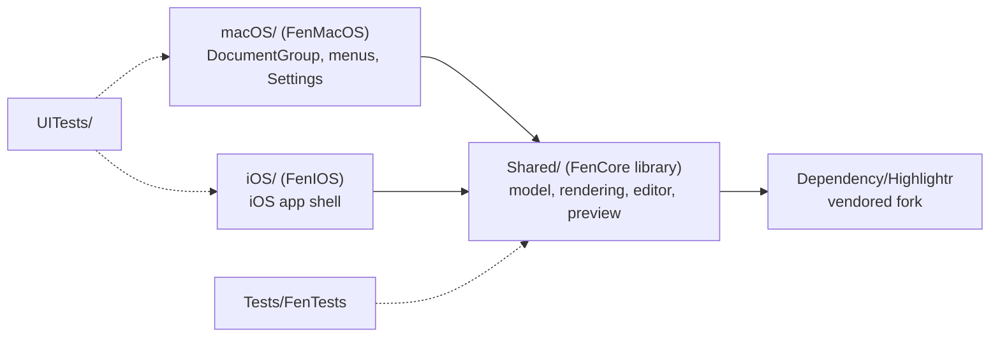
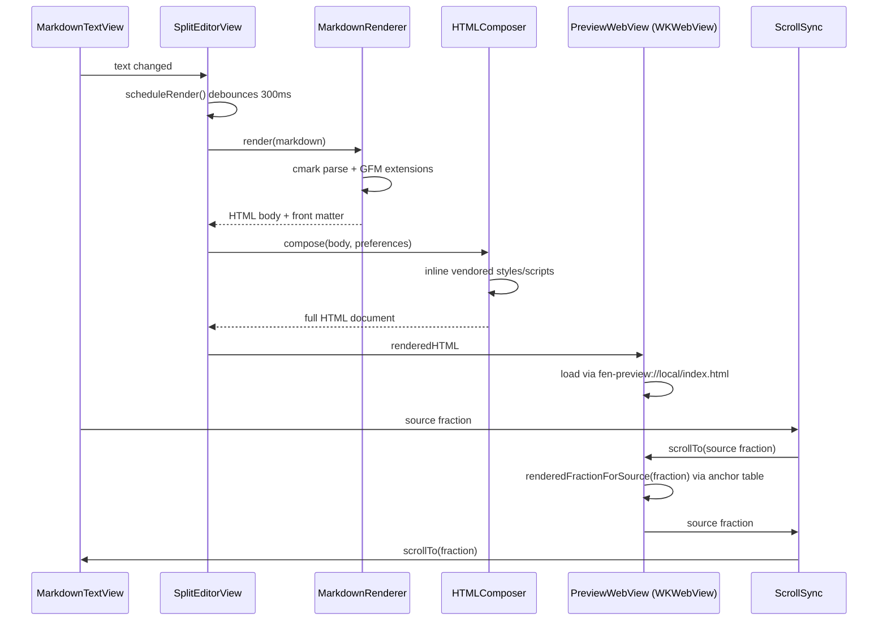
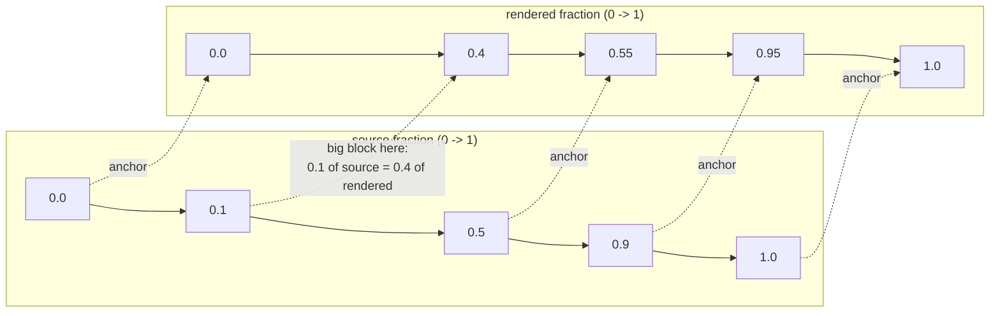
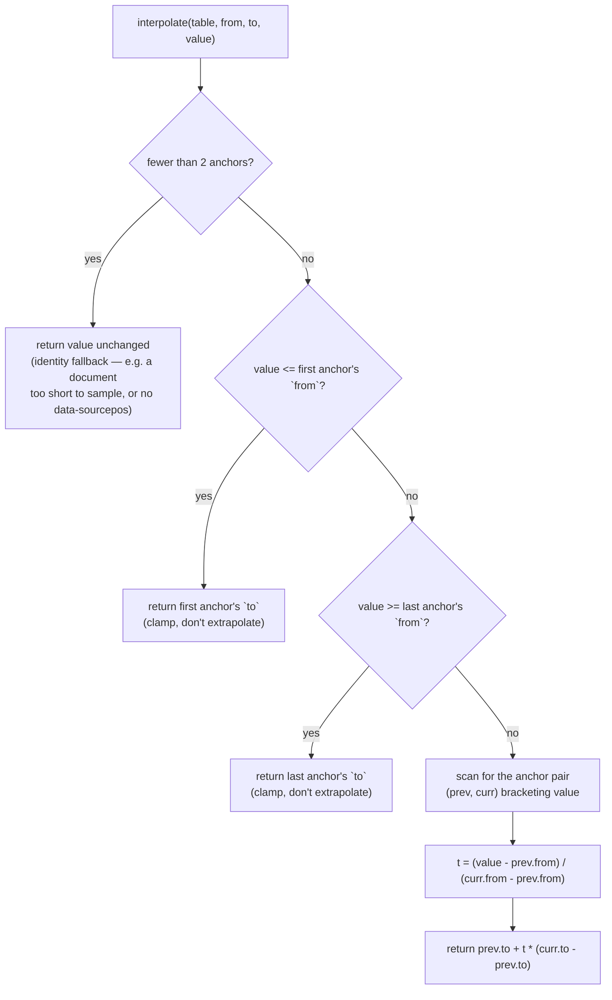
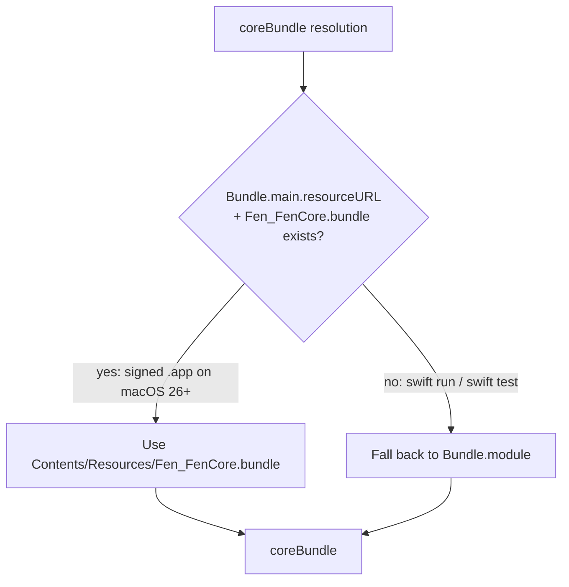
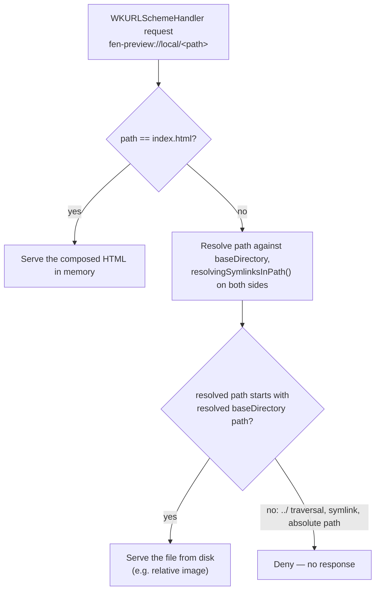
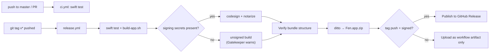

# Architecture

This covers the decisions that aren't obvious from reading the code — why things are shaped the way they are, and the bugs that shaped them. For what's built and what's next, see [ROADMAP.md](ROADMAP.md). For project layout, see [README.md](../README.md#project-layout).

## FenCore: one model, two platforms

`Shared/` builds as the `FenCore` library target. `macOS/` and `iOS/` are thin executable targets that depend on it — `FenMacOS` wires up `DocumentGroup`, menus, and `Settings`; `FenIOS` wires up the iOS shell. Neither platform target should carry business logic: if code doesn't need `AppKit` or `UIKit`, it belongs in `FenCore` so both platforms get it for free. See [CONTRIBUTING.md](../CONTRIBUTING.md#coding-style) for the enforcement rule.

## Editing to preview: the rendering pipeline

Typing in the editor doesn't re-render on every keystroke. `SplitEditorView.scheduleRender()` cancels any in-flight render `Task`, waits 300ms (skipped if `preferences.markdownManualRender` is set), then runs the document through `MarkdownRenderer` and `HTMLComposer` before handing the result to the `WKWebView`-backed preview. `ScrollSync` mirrors scroll position between the two panes as a fraction (0.0–1.0) of the *source* document, guarded by an `isUpdating` flag so each pane's update doesn't re-trigger the other.

A plain-text source line and its rendered HTML rarely take up the same proportion of their pane — a fenced code block, an image, or a table can occupy very different vertical space in the editor than in the preview. `SplitEditorView` renders with `MarkdownRenderer.Options.sourcePositions = true`, which makes cmark-gfm emit `data-sourcepos` on every block element; `Shared/Resources/ScrollSync/scroll-sync.js` (vendored into the preview via `HTMLComposer`) reads those attributes to build a table mapping source-line fraction to rendered-pixel fraction, then interpolates between the two piecewise-linearly. That table is rebuilt whenever the viewport's dimensions or the document's scroll height change — not just once on load — so a window resize, a split-divider drag, or an async Mermaid/MathJax render growing the page doesn't leave later lookups predicting from a stale layout. The preview's `PreviewWebView` routes every scroll fraction through `window.__fenScrollSync.sourceFractionForRendered`/`renderedFractionForSource` before it reaches or leaves `ScrollSync`, so `ScrollSync` itself only ever deals in source-document fractions — the editor needs no translation, since its plain-text layout is already a reasonable proxy for source-line fraction.

`PreviewWebView`'s macOS `Coordinator` applies an incoming scroll fraction by setting `document.documentElement.scrollTop` through `evaluateJavaScript`, which itself triggers a DOM `scroll` event — WebKit dispatches that event asynchronously, around the next frame, well after `evaluateJavaScript`'s own completion handler runs on the Swift side. A guard flag cleared from that completion handler races the real event and can clear before it fires, letting the assignment's own self-triggered scroll leak back through the `scroll` listener as a "user scroll," feeding a slightly-off fraction back into `ScrollSync` on every sync round-trip — this is what compounded into visible drift the deeper a document went, even after the anchor-table fix above. An earlier fix tried clearing a `window.__fenSuppressScrollEvent` flag after two nested `requestAnimationFrame` callbacks instead of from the Swift completion handler, tying the guard to the same frame timing WebKit uses to actually dispatch the event — but `requestAnimationFrame` never fires at all in a window with no live display link, which includes the off-screen `NSWindow` `Tests/FenTests/PreviewScrollRaceVerifyTest.swift` uses under `swift test` (no running `NSApplication` event loop). `scrollAssignmentJS` now instead records the exact pixel value it's about to write to `window.__fenExpectedScrollTop`; `scrollObserverJS`'s listener suppresses only the one `scroll` event whose `scrollTop` matches that value, then clears the expectation immediately — tied to the assignment's own effect, not to whether or when a frame renders. `PreviewScrollRaceVerifyTest.swift` proves this against a real, attached `WKWebView` — a paced, synthetic UI-test scroll gesture waits for the app to go idle after each step, which is slow enough to hide this exact race, so this had to be caught with a test that lets the browser's real asynchronous event timing run.

## Anchor-table interpolation: the shared math

Both anchor tables — `scroll-sync.js`'s `data-sourcepos`-derived one and `EditorScrollAnchors.swift`'s word-wrap-derived one — are sorted lists of `(source, rendered)` pairs, where both fields run 0→1 and increase monotonically. Between two documents that share content but differ in per-block density, the two axes drift apart: a block that's short in the source but tall once rendered (an image, a table, a big fenced code block) pulls the `rendered` value for every anchor after it further ahead of `source`. Mapping a fraction from one axis to the other means walking the table to find the two anchors it falls between, then interpolating linearly within that segment — never extrapolating past the first or last anchor.

`interpolateEditorAnchor` (Swift) and `interpolate` (JS) both implement the same lookup, deliberately kept in lockstep — `Tests/FenTests/CrossLanguageInterpolationTest.swift` runs identical tables and probe values through both to prove they agree:

Both implementations rebuild their table lazily rather than once: `computeEditorLineAnchors` is only re-run when the editor's text or laid-out height changes (`refreshAnchorsIfNeeded` in `MarkdownTextView.swift`/`MarkdownTextView_iOS.swift`), and `scroll-sync.js`'s `refreshAnchorsIfStale` re-checks the viewport and scroll-height dimensions on every lookup — see the "instead of predicting from a stale layout" note above for why a table cached forever caused visible drift after a reflow.

## Resource bundle resolution (`Shared/CoreBundle.swift`)

SwiftPM's generated `Bundle.module` accessor resolves resources against `Bundle.main.bundleURL`. That's correct for `swift run` and `swift test`, but wrong for a signed, distributed `.app`: macOS 26 requires nested resource bundles to live under `Contents/Resources/` (`Bundle.main.resourceURL`), not the bundle root. A build that only used `Bundle.module` crashed on file open on macOS 26 — fixed in v0.2.0–v0.2.4 (see `CoreBundle.swift`'s doc comment for the full resolution order).

`coreBundle` checks `resourceURL` first, falling back to `Bundle.module` for local dev builds. `scripts/build-app.sh` and the `release.yml` workflow both verify the resulting bundle layout after building (see `release.yml`'s "Verify bundle structure" step) so this can't regress silently.

**If you add a new SPM resource target or bundle**, make sure it lands in `Contents/Resources/` with an `Info.plist` in the packaged `.app`, and add a check for it in `release.yml`.

## Preview: a custom URL scheme, not `loadHTMLString(baseURL:)`

The live preview (`Shared/Preview/PreviewWebView.swift`) renders through `WKWebView`. The obvious approach — `loadHTMLString(_:baseURL:)` — sets the document's base URL for resolving relative links, but does **not** grant the web view read access to that directory. Relative-path images in a Markdown document (``) silently failed to load under that approach.

Instead, `PreviewSchemeHandler` implements `WKURLSchemeHandler` for a custom `fen-preview://` scheme. The main document loads from `fen-preview://local/index.html`; every other request resolves against the document's directory on disk (`baseDirectory`) through the shared `resolvedFileURL(for:baseDirectory:)` helper, which calls `resolvingSymlinksInPath()` on both the candidate file and `baseDirectory` before checking that the former's path starts with the latter's — resolving symlinks on both sides, not just collapsing `.`/`..` segments, closes the gap where a symlink planted inside `baseDirectory` could point outside it and pass a naive prefix check. Keep that check load-bearing — it's the only thing standing between a crafted Markdown file and arbitrary local file reads.

The same `resolvedFileURL` guard backs `internalLinkTarget(for:)`, which a clicked preview link runs through first: a same-page anchor (`#section`) returns `nil` and stays on `fen-preview://local/index.html`, while a link that resolves to a *different* file on disk returns that file's URL. `PreviewWebView.Coordinator` cancels the in-place navigation for the latter and opens it as its own document instead — `openDocument(at:)` on macOS, `UIApplication.shared.open(_:)` on iOS — rather than letting `WKWebView` load that file's raw text as if it were HTML.

A second `WKUserScript`/message-handler pair, alongside the scroll-position one described below, reports which link the pointer is over: `Shared/Preview/LinkHoverJS.swift`'s `linkHoverObserverJS` posts a hovered link's raw `href` through a `linkHoverHandler` channel, which `SplitEditorView` shows in a status bar under the preview (macOS only) and clears on mouseout.

## Highlightr fork (`Dependency/Highlightr`)

The editor's live syntax highlighting uses a vendored fork of [Highlightr](https://github.com/raspu/Highlightr), not the upstream package, because upstream resolves its bundled JS/CSS against `resourceURL` in a way that broke under the same macOS 26 resource lookup change described above. See the fork's own commit history for the exact patch. HTML-export syntax highlighting is separate — it loads the same underlying [highlight.js](https://highlightjs.org) library directly (core script, theme CSS, and an init script) through `HTMLComposer`, rather than going through Highlightr's JavaScriptCore wrapper.

## Every third-party resource is vendored, not loaded from a CDN

Fen's trust model is local-first: it reads and writes only the files you open, and it makes no runtime network calls. `HTMLComposer` (`Shared/Rendering/HTMLComposer.swift`) composes the preview and export HTML entirely from files bundled inside `Fen.app` — highlight.js lives in `Shared/Resources/Highlight/`, while Mermaid, MathJax, and the task-list script live in `Shared/Resources/Extensions/` (or `Styles`/`Templates` alongside them), and all of them load through `loadResourceFile(name:ext:subdirectory:)`, never through a `<script src="https://...">` tag.

MathJax used to be the exception: earlier builds pulled `MathJax.js` from `cdnjs.cloudflare.com` at render time. That meant a delay on first render, a broken feature offline, and an unnecessary network call from a documented local-first app. It's now vendored the same way as Mermaid — `Shared/Resources/Extensions/mathjax-tex-svg.js` bundles MathJax v3's `tex-svg` output (SVG glyphs, no separate web-font files, so it stays a single self-contained file), with attribution in `LICENSE/mathjax.txt` (Apache License 2.0, compatible with bundling into an MIT-licensed app).

**If you add any feature that loads a remote script, style, or font, vendor it into `Shared/Resources/Extensions/` (or the appropriate `Resources/` subdirectory) instead** — see `mermaidTags()` and `mathJaxTags()` in `HTMLComposer.swift` for the pattern. `Package.swift`'s `.copy("Resources/Extensions")` picks up new files in that directory automatically, no build config change needed.

## CI and releases

`.github/workflows/ci.yml` runs `swift test --no-parallel` on every push and pull request against `master`. `.github/workflows/release.yml` runs on a `v*` tag push (or manual dispatch): it builds and tests the same way, then signs and notarizes only if the signing secrets are present, verifies the resulting bundle structure (see [Resource bundle resolution](#resource-bundle-resolution-sharedcorebundleswift) above), zips it, and publishes it to a GitHub Release. See [RELEASING.md](RELEASING.md) for cutting a release by hand when secrets aren't configured in CI.

Both workflows pass `--no-parallel`: several suites (`ZoomOutScrollPositionVerifyTest`, `PreviewReloadRaceVerifyTest`, `PreviewLinkHoverVerifyTest`, `FontSizeLiveUpdateVerifyTest`, `PreviewScrollRaceVerifyTest`, `ScrollSyncVerifyTest`, and others) drive a real `WKWebView`, and Swift Testing's default parallel mode runs multiple instances at once — GitHub's macOS runner doesn't have the cores to keep their real-time JS evaluation from slipping under that much concurrent load, which reproduced as a different failing subset on 4 of 4 consecutive CI attempts on the same commit before serializing fixed it. This is a separate concern from timing correctness within a single test: those suites poll for the actual condition they need (`Tests/FenTests/WebViewPreviewTestSupport.swift`'s `pollUntilTrue`, either against JS state or an arbitrary Swift-side condition) rather than sleeping a fixed duration and hoping it was long enough — see [CONTRIBUTING.md](CONTRIBUTING.md#tests) for that rule. Local `swift test` (parallel, faster) is fine for day-to-day work since a real machine has more headroom; rerun with `--no-parallel` to reproduce a CI-only failure locally.

## Versioning has no single source of truth in-repo

Marketing version comes from the git tag at build/release time (`scripts/build-app.sh`, `RELEASING.md`); it's not stored in `Package.swift` or `project.yml`. `site/index.html`'s JSON-LD `softwareVersion` is a separate, manually maintained string for SEO — update it when you cut a release, and treat it as informational rather than a guaranteed match to any specific build.
